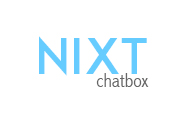

# NIXT Chatbox




NIXT Chatbox is Unix-based is a multi-threaded instant messaging system that allows both private and group
chats, developed in C. 

As Carnegie Mellon computer science students we ssh to afs (Andrew File System) frequently, and we realized that when we want to discuss ideas or projects we tend to leave our Unix Shell, and use some instant messaging app like WhatsApp or Facebook messenger, then switch back to the Unix Shell. So, we decided to develop NIXT Chatbox as a mean of communication between us in the terminal environment, and of course, we thought it would be cool to develop our own instant messaging app!

Necessary dependencies:
CURL Library


# Getting Started

- clone the repo
``` shell
git clone https://github.com/afomer/Nixt-Chatbox
```
- Compile the code
``` shell
make
```
- Run the server on an listening port [if you want to run a server of your own]
``` shell
./server 1220 &
```

- Run the client executable with rlwrap and put the ip and the port of the server
``` shell
rlwrap ./client linux12.qatar.cmu.edu 1220
```
